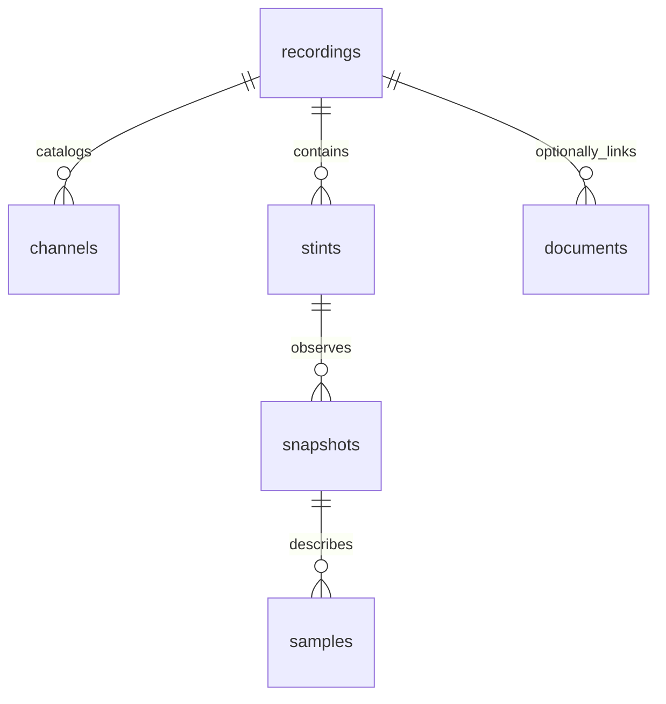

# Local SQL storage

Both extractors now write to SQLite as well as their existing files. SQLite runs inside Python; no database service is needed. The default database is `~\.iracing-app\storage\iracing.sqlite3`, outside this OneDrive project folder and the AppData tree that Windows can redirect for packaged apps. This path is based on the user's home directory so packaged hosts and normal terminals use the same database. Set `IRACING_DATABASE` or pass `--database` to choose another local path. Python 3.11+ with SQLite JSON support is required.

This version supports a local capture workload with concurrent readers. A frontend can use the read-only HTTP API; Python analytics can use `Store` or SQL. SQLite fits device-local application data with low write concurrency. A future central database with many simultaneous writers would require a separate server-database migration. See [SQLite's database selection guidance](https://www.sqlite.org/whentouse.html).

## Quick start

Run from the GitHub checkout:

```powershell
.\.venv\Scripts\python.exe -m pip install -r requirements.txt
.\.venv\Scripts\python.exe -m iracing_storage init

# Capture with the simulator running; prints the recording ID and database path.
.\.venv\Scripts\python.exe iracing_local.py

.\.venv\Scripts\python.exe -m iracing_storage list
$rid = 'PASTE-RECORDING-ID'
.\.venv\Scripts\python.exe -m iracing_storage inspect $rid
.\.venv\Scripts\python.exe -m iracing_storage catalog $rid
.\.venv\Scripts\python.exe -m iracing_storage snapshots $rid --limit 10
.\.venv\Scripts\python.exe -m iracing_storage samples $rid --channels Speed,Brake,Throttle --lap 2 --limit 100

# Read-only frontend data service. Ctrl+C stops it.
.\.venv\Scripts\python.exe -m iracing_storage serve
```

`--no-database` on either extractor retains file-only operation. `iracing_client.py` stores successful web API responses as versioned documents as well as JSON files. For custom database paths, put the storage CLI's global option before the subcommand:

```powershell
.\.venv\Scripts\python.exe -m iracing_storage --database 'D:\iRacingData\telemetry.sqlite3' init
.\.venv\Scripts\python.exe iracing_local.py --database 'D:\iRacingData\telemetry.sqlite3'
.\.venv\Scripts\python.exe -m iracing_storage --database 'D:\iRacingData\telemetry.sqlite3' list
```

## Schema



| Table / view | Contents |
| --- | --- |
| `recordings` | UUID, source, timestamps, capture status, sample count, profile JSON and extensible metadata |
| `channels` | Per-recording SDK catalog: units, native types, array counts, descriptions and profile selection |
| `stints` | Recording relationship, collector stint number and extensible metadata |
| `snapshots` | Raw session/setup YAML text, parsed JSON, update number, provenance and parse errors |
| `samples` | Sequence, original SDK tick, capture timestamp, stint/snapshot links, indexed session/lap/time fields and all recorded values |
| `documents` | Arbitrary JSON with kind, schema version, source and optional recording relationship |
| `telemetry_channels` | View exposing each sample's channels as typed rows for aggregation |
| `setup_fields` | View exposing setup leaves as full JSON paths, types and values, including array elements |

Foreign keys enforce that each sample's snapshot belongs to the same recording and stint. Common time and lap filters are indexed. JSON contains the full values; indexed columns are query aids. A monotonic sample sequence preserves ordering across repeated/reset SDK ticks.

Each sample occupies one SQL row. The channel view expands values only when queried using [SQLite JSON functions](https://www.sqlite.org/json1.html). This avoids a schema column or permanent row for every possible channel at every tick.

## Extending telemetry and setups

Add fields to the capture profile when more SDK data is needed. New selected values, including arrays, are stored automatically. Each recording keeps its own profile and runtime catalog. No schema migration is required, but fields never captured cannot be reconstructed for old recordings.

Setups remain nested documents. One car can have `Chassis.RideHeight`; another can have `Aero.Wing` or tire-pressure arrays. Shapes need not match. Text and units such as `55 mm` remain unchanged. `setup_fields` supplies paths for comparison without inventing common units or a fixed garage layout. Empty objects and arrays remain in setup JSON; the leaf view has no rows for empty containers.

The collector creates snapshots at stint start and whenever it observes a SessionInfo update. Samples reference the latest observed snapshot. This is an SDK observation, not proof of the exact instant a garage change physically took effect. Original `car_setup.json` and `.yaml` files retain stint-start setup; later versions are in SQL and the session update log.

Missing values retain `_unavailable` and their reason. They are never replaced with zero. A requested channel absent from a stored sample returns `{"_unavailable":true,"reason":"not_recorded"}`. NaN and infinities use reserved markers `{"_nonfinite":"nan"}`, `{"_nonfinite":"inf"}` and `{"_nonfinite":"-inf"}`, including inside arrays, to keep database/API JSON valid. Indexed numeric columns use SQL NULL for invalid or unavailable values.

Decoded raw YAML text survives parsing errors, which are recorded in `parse_error`. YAML dates become text in parsed JSON and non-string keys become string keys; raw text remains the reference. No setup values are automatically normalized or written back to iRacing.

Future domains such as weather, annotations or analysis outputs can start as documents:

```powershell
.\.venv\Scripts\python.exe -m iracing_storage import-json '.\weather.json' --kind weather --schema-version 1 --recording-id $rid
.\.venv\Scripts\python.exe -m iracing_storage documents --kind weather
```

Document imports append observations. If a domain later needs specialized joins/indexes, add a numbered migration and update the migration runner/schema version. Do not edit `001_initial.sql` to upgrade existing databases. DDL and version changes run transactionally; newer schemas and unrelated unversioned databases are rejected rather than modified.

## Existing captures

Select one closed capture directory containing `catalog/` and `stints/`:

```powershell
.\.venv\Scripts\python.exe -m iracing_storage import-capture '.\data\captures\YOUR-CAPTURE'
.\.venv\Scripts\python.exe -m iracing_storage import-json '.\data\iracing-response.json' --kind iracing_api:member_info
```

Imports stream batches within one transaction, hash source contents, deduplicate repeat imports, and verify that files stayed unchanged. Malformed/truncated JSON lines, missing required files or source changes roll back the whole recording. Large imports hold the writer lock; import when no live capture is writing to that database.

New exports include a manifest, profile copy, initial session YAML and sample boundaries for session updates. These reconstruct observed snapshot-to-sample links. Captures with a live recording already in this database are rejected; use a separate database for restoration. A manifest marked `recording` is rejected because it may still be active.

Legacy exports lack update timestamps/boundaries and retain only the latest session YAML per stint. The importer preserves stint-start setup, labels the mixed source `legacy_stint_setup_latest_session_info`, and stores update snapshots as `legacy_update_timing_unknown`. It does not infer when an old sample saw a later setup. Imported recordings have status `imported`; original manifest status, when present, stays in metadata. Hashing detects changes during import but cannot prove an unmarked legacy capture is closed; stop its collector first.

## Frontend interface

The service listens only on `127.0.0.1:8765`, serving the connected session viewer at `/` with a read-only database connection per API request. Startup initializes the database if absent. It exposes no SQL execution or mutation endpoint, and cross-origin browser requests are rejected. This is a local application service, not a remotely hosted production backend.

| GET endpoint | Query parameters |
| --- | --- |
| `/api/v1/recordings` | `limit`, `offset` |
| `/api/v1/library` | `limit`, `offset`; compact recordings with observed track and player car |
| `/api/v1/recordings/{id}` | None; includes stints |
| `/api/v1/recordings/{id}/overview` | None; incremental lap aggregates, latest telemetry, identity and coverage |
| `/api/v1/recordings/{id}/trace` | Required `start`, `end` sample sequences; optional `limit` (40–5,000, default 1,200) |
| `/api/v1/recordings/{id}/catalog` | None |
| `/api/v1/recordings/{id}/samples` | `after`, `limit`, `channels`, `stint_id`, `session_num`, `lap`, `time_min`, `time_max` |
| `/api/v1/recordings/{id}/snapshots` | `after` snapshot ID, `limit` |
| `/api/v1/documents` | `kind`, `limit`, `offset` |

Limits range from 1 to 5,000. Sample responses contain `items`, `has_more` and `next_after`. Fetch the next page with `after=next_after`; the cursor is a sample sequence, not an SDK tick. Retain it when polling yields no items. `has_more=false` means no additional committed matching samples at that moment, not that capture finished. Snapshot pagination uses the last returned snapshot ID. Other list responses are wrapped in `items`.

`captured_at` is a UTC Unix timestamp in seconds. `session_time` is the simulation clock in seconds; `lap_distance` is SDK `LapDistPct`, normally a fraction. Filter by `session_num` and `stint_id` to distinguish repeated laps or clocks. `lap` is a simulator lap number, not a global lap ID. Raw storage does not modify or interpolate measurements.

The viewer projection derives lap segments and conservative completeness from observed boundaries, recorded lap timing and missing/pit/incident checks. It processes up to 25,000 additional samples per overview request, maintaining an in-memory cache of up to eight recordings. `caught_up=false` marks provisional results until history is processed. Cache eviction or server restart recomputes projections from SQLite without modifying source data. Trace responses stream the requested sequence range and return bounded representative points; they are intended for individual laps. See the [frontend guide](frontend/README.md) for measurement boundaries.

```python
from iracing_storage import Store

with Store(readonly=True) as db:
    recording = db.list_recordings(limit=1)[0]
    page = db.samples(recording['id'], channels=['Speed', 'Brake'], limit=1000)
    snapshots = db.snapshots(recording['id'])
    # sample.snapshot_id joins to its observed setup/session snapshot.
```

Low-level `Store` writes require `with db.connection:` to commit the transaction. The live writer and importer manage this themselves. Closing `Store` does not silently commit unfinished work.

## Analytics SQL

Use bound parameters and group by stint/session/lap, not lap alone:

```sql
SELECT stint_id, session_num, lap,
       MIN(session_time) AS first_observed_time,
       MAX(session_time) AS last_observed_time,
       COUNT(*) AS recorded_samples
FROM samples WHERE recording_id = :recording_id
GROUP BY stint_id, session_num, lap;

SELECT stint_id, session_num, lap, AVG(value) AS average_speed_mps
FROM telemetry_channels
WHERE recording_id = :recording_id AND channel = 'Speed'
  AND value_type IN ('real', 'integer')
GROUP BY stint_id, session_num, lap;

SELECT snapshot_id, path, value_type, value
FROM setup_fields WHERE recording_id = :recording_id
ORDER BY snapshot_id, path;

SELECT sequence, lap_distance, json_extract(values_json, '$.Speed') AS speed_mps
FROM samples
WHERE recording_id = :recording_id AND stint_id = :stint_id
  AND session_num = :session_num AND lap = :lap
ORDER BY sequence;
```

JSON views are more expensive than indexed scalar queries. Filter recordings/laps/times and introduce specialized indexes or persistent derived analytics tables as workloads grow. The viewer reduces trace responses for display but retains all stored samples. This version has no automatic retention deletion or compressed columnar export. Full-resolution JSON trades disk space for flexible querying.

## Durability and backups

Live batches commit at 60 samples or when the collector next checks the one-second flush interval, plus stint/update boundaries and shutdown. WAL allows concurrent readers of committed batches. `synchronous=FULL`, foreign keys and transactions are enabled. See [SQLite WAL documentation](https://www.sqlite.org/wal.html).

A clean disconnect or tick limit marks `completed`; Ctrl+C marks `interrupted`; a handled error marks `failed` when final storage writes succeed. A process crash or storage failure can leave `recording` status: finalization is unknown, not proof the process is alive. Committed batches survive restart; pending samples may be lost. Other processes' recording states are not automatically changed.

Files and SQL cannot share one atomic transaction. A failure may leave more complete JSONL rows than SQL rows. Keep exports for recovery and inspect interrupted captures before restoring. No automatic truncated-file repair is performed. Batching does not make SDK extraction lossless; a collector that falls behind can still skip SDK ticks.

Keep the database on local disk outside OneDrive/network shares. Back up with SQLite's online backup operation instead of copying a live database without its WAL:

```powershell
.\.venv\Scripts\python.exe -m iracing_storage backup 'D:\iRacingBackups\session-backup.sqlite3'
```

The destination must not exist. A successful backup includes committed state. A failed backup may leave an incomplete destination; use it only after the command succeeds. Capture files are separate and should also be backed up.

## Validation

```powershell
.\.venv\Scripts\python.exe -m unittest discover -v
.\.venv\Scripts\python.exe scripts\benchmark_storage.py
```

See [validation results](STORAGE_VALIDATION.md) for coverage, synthetic throughput and the remaining real-simulator check.


## Stint capture and Windows startup

`py start.py all` prepares the virtual environment, dependencies and database before launching capture/viewer. Both use `%USERPROFILE%\.iracing-app\storage\iracing.sqlite3` on each PC, unless overridden; local storage is not device synchronization.

New live stints contain only on-track driving outside pit lane/garage. Pit entry or car exit closes the stint; pit exit starts another. One session/setup snapshot is saved at each stint start. Telemetry rows reference that snapshot. The older session-update storage/import APIs remain available to read/import historical capture formats, but live capture no longer calls them every session update. Existing stored data is unchanged.

The viewer is on demand. Library date filtering happens in SQL before pagination using `from` (inclusive) and `until` (exclusive) Unix timestamps. Trace endpoints accept `start_pct`/`end_pct` to load a sector or custom distance range before reducing points. Overview results include `sectors`, lap `sector_seconds`, and `stint_setups` (the earliest snapshot per stint).
